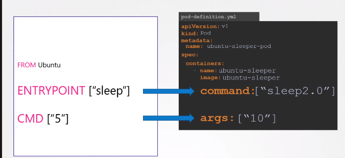

# Commands and arguments 

- `command:` from pod defination file is used to override `ENTRYPOINT` from Docker
- `args:` from pod defination file is used to override `CMD` from Docker

TODO Checkout lecure 39

