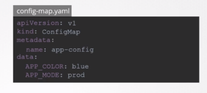
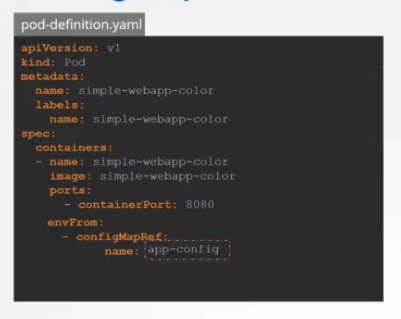
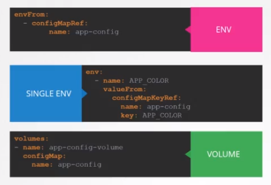

# ConfigMaps

- If ENV Variables are large i size, We can take out those and we can manage it centrally in configMap
- Two steps are involved 
    - Create configMap
        - Imperative way 
            - `kubectl create configmap <config-name> --from-literal=<key>=<value> --from-literal=<key>=<value>`
            - `kubectl create configmap <config-name> --from-file=app.properties`
        - Declarative way 
            - 
            Need to run `kubectl create -f config-map.yml`
    - Inject configMap
        
        
    

- To view `kubectl get configmaps`

### Other ways to inject configMaps

1. Single environment value 
2. Inject whole data as a file in volume 

