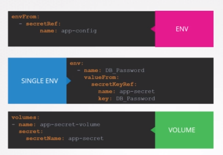

# Secrets 

- ConfigMap stores data in plain text
- Secrets used to store sensetive data
- Hashed / encrypted 

### Two steps are involved
- Create configMap
   - Imperative way
        - `kubectl create secret generic <secret-name> --from-literal=<key>=<value> --from-literal=<key>=<value>`
        - `kubectl create secret generic <secret-name> --from-file=app.properties`
        - Declarative way
              
              Need to run `kubectl create -f config-map.yml`
              - To encode secrets
                `echo -n 'mysql_pass | base64`
              - To decode secrets
                `echo -n 'mysql_pass | base64 --decode`
    - Inject configMap
        

- To get secrets - `kubectl get secrets`    
- To desribe secrets - `kubectl describe secrets`
- To view values -  `kubectl get secret secret-name -o yaml`

### Secrets in pods

### Secrets in Pods as Volumes 
- For each key-val secret, file is created 

