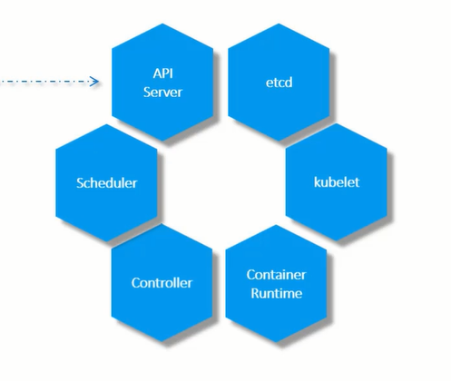
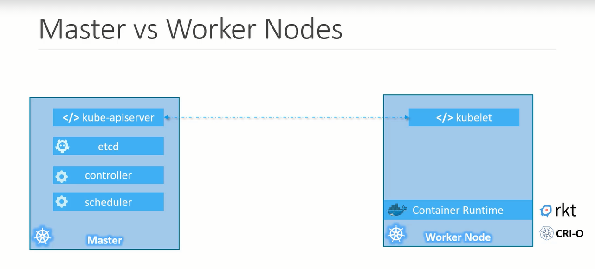

# K8s Architecture

## Node (Minions)
- Node is a machine physical or virtual on which k8s is installed
- A working machine where container will be launched

## Clusters
- list(nodes) for high availability , load balancing

## Master
- Another node 
- manages cluster
- Information about clusters is stored 
- To manage node, When node fails, manages the workload
- Responsible for actual orchastation of containers on the worker nodes

# K8s compenents 

## API Server
- FE for k8s
- Users, CLI, all talks to API server to interact with K8s cluster

## etcd
- Distrubuted , Reliable key val store used by k8s to store all data used to manage the cluster
- Example - When you have multiple nodes and multiple masters in cluster `etcd` stores all that information on all nodes in the cluster in a distributed manner 
- Responsible for implementing locks within a cluster to ensure there are no conflicts between the masters
 
## Scheduler 
- Distributing work across multiple nodes
- It looks for newly created containers & assigns them to nodes 

## Controller
- Brain behind orchestration 
- They are responsible for noticing and responding when nodes, containers or endpoints goes down
- The controller make decisions to bring up new containers in such cases

## Container Runtime 
- Underline software which is used to run containers (Docker)

## Kubelet
- Runs on each nodes in cluster 
- Making sure containers are running on nodes as expected  

# Master vs Nodes

## Kubectl
- CLI

