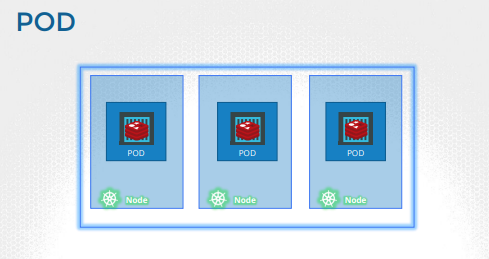
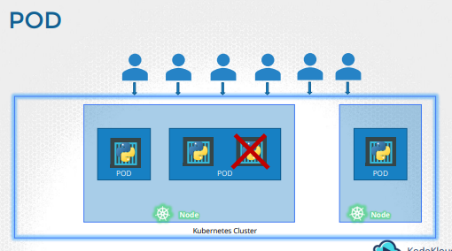
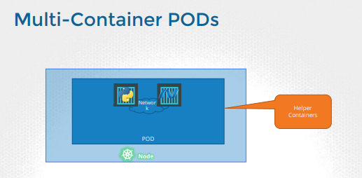
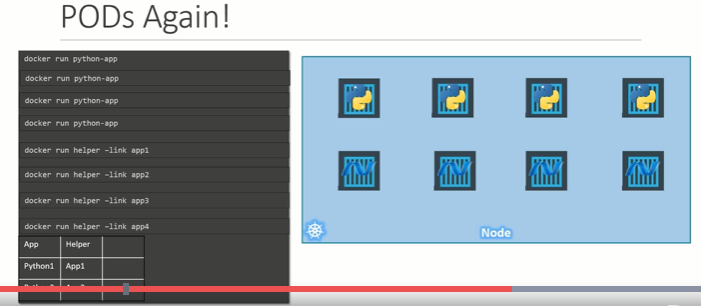
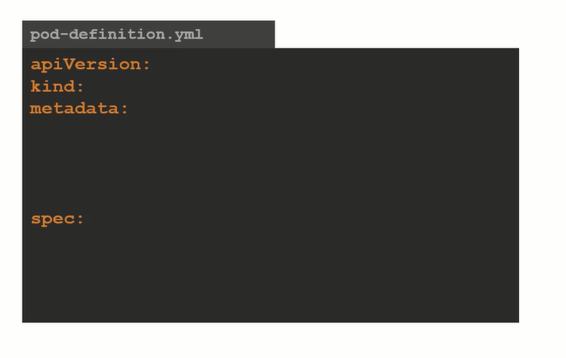
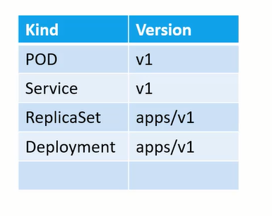

# Pods 



- Containers are encapsulated into Pods
- Pod is single instace of an application
- The Smallest object that you can create in k8s
  


- When load increased - When you want to spin up additional instance of app, You do not create another container instance within pod, You should create another pod
- When load futher increases - Spin up new node
- Pods should have 1 to 1 relationship with containers 


- Multi container pods are technically possible but container should be of different kind.
- 2 containers can talk to each other using localhost 


- Lets keep k8s aside, lets only talk about single docker containers
- Deploy python-app & helper nodes, link them , take care of volume. 
- While deploying another instance, above process repeats 
- When app dies, manually kill helper container & take care of other containers
- **With pods, K8s does above all automatically for us**

## PODs with YAML

- Above are k8s top / root level fields
- All above are required fields


- Above are the possible apiVersion values & kind values 

- Metadata is data about an object & it is dictionary 
    - name - String value
    - labels - Dictionary - Can have any key-value pair 
```yaml
metadata:
  name : myapp-pod
  labels :
     app : myapp
```

- spec
    - It is additional infromation
    - Each k8s object has different info
    - It is dicory
```yaml
spec:
  - containers :
      - name : nginx-container
        image : nginx
```


