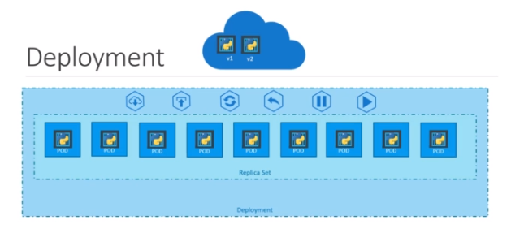

#Deployments 

How you want to deploy app to PROD ?

- You may have multiple instaces running in prod 
- Upgrade version on by one - rolling upgrade
- Rollback changes in faulty 


- From above image deployemnt is one step up from replicasets

### Defination File


```yaml
apiVersion: apps/v1
kind: ReplicaSet
metadata:
  name: frontend
  labels:
    app: guestbook
    tier: frontend
spec:
  # modify replicas according to your case
  replicas: 3
  selector:
    matchLabels:
      tier: frontend
  template:
    metadata:
      labels:
        tier: frontend
    spec:
      containers:
      - name: php-redis
        image: gcr.io/google_samples/gb-frontend:v3
```
- Same as replica set defination file, Except **_`kind: deployement`_**


```
kubectl create -f file.yml
k get deployements 
```

//TODO Comman commands

kubectl [command] [TYPE] [NAME] -o <output_format>

Here are some of the commonly used formats:

-o jsonOutput a JSON formatted API object.

-o namePrint only the resource name and nothing else.

-o wideOutput in the plain-text format with any additional information.

-o yamlOutput a YAML formatted API object.


--dry-run: By default as soon as the command is run, the resource will be created. If you simply want to test your command, use the --dry-run=client option. This will not create the resource, instead, tell you whether the resource can be created and if your command is right.

-o yaml: This will output the resource definition in YAML format on the screen.


Use the above two in combination to generate a resource definition file quickly, that you can then modify and create resources as required, instead of creating the files from scratch.


POD
Create an NGINX Pod

kubectl run nginx --image=nginx


Generate POD Manifest YAML file (-o yaml). Don't create it(--dry-run)

kubectl run nginx --image=nginx  --dry-run=client -o yaml


Deployment


Create a deployment

kubectl create deployment --image=nginx nginx


Generate Deployment YAML file (-o yaml). Don't create it(--dry-run)

kubectl create deployment --image=nginx nginx --dry-run -o yaml


Generate Deployment with 4 Replicas

kubectl create deployment nginx --image=nginx --replicas=4


You can also scale a deployment using the kubectl scale command.

kubectl scale deployment nginx --replicas=4


Another way to do this is to save the YAML definition to a file.

kubectl create deployment nginx --image=nginx--dry-run=client -o yaml > nginx-deployment.yaml


You can then update the YAML file with the replicas or any other field before creating the deployment.


Service
Create a Service named redis-service of type ClusterIP to expose pod redis on port 6379

kubectl expose pod redis --port=6379 --name redis-service --dry-run=client -o yaml

(This will automatically use the pod's labels as selectors)

Or

kubectl create service clusterip redis --tcp=6379:6379 --dry-run=client -o yaml  (This will not use the pods labels as selectors, instead it will assume selectors as app=redis. You cannot pass in selectors as an option. So it does not work very well if your pod has a different label set. So generate the file and modify the selectors before creating the service)