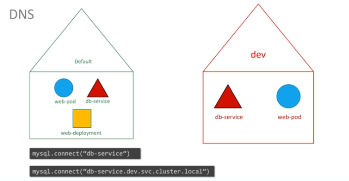
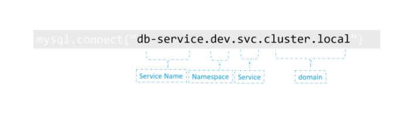
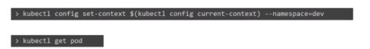
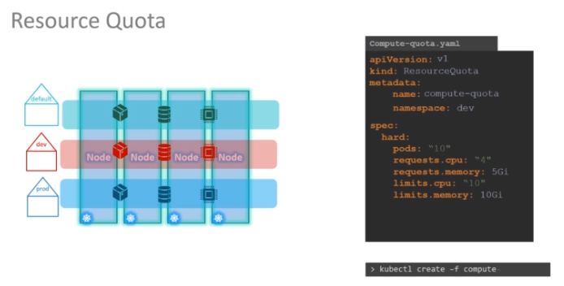

# Namespaces 

- Analogy is similar to packages from java

Namespaces present initially 
- 'default' namespace is present and created automaticcaly when cluster is set up
- K8s creates pods and services for internal purpose (for example netowking,DNS). To isolate this from user and to prevent it from accidently deleting it, K8s keeps it in another namespace - 'kubesystem' created at cluster startup
- 'kube-public'

### To access resource from currant namespace & different namespace


- Above thing is possible because service has create a DNS entry added automatically in this format
- Break up of DNS is given below 



- Use `--namespace=name` to create resources in specified namespace
- If you do not want to specify, You can specify namespace under file. It is a good way to ensure that creation is done under correct namespace


### To create namespace

1. 
```yaml
apiVersion: v1
kind: Namespace
metadata: 
  name: dev
```
`kubectl create -f namespace-dev.yml`

2. 
`kubectl create namespace dev`

### To switch namespace permanently 



### To view pods in all namespaces 

`kubectl get pods --all-namespaces`

### To limit resource quota

